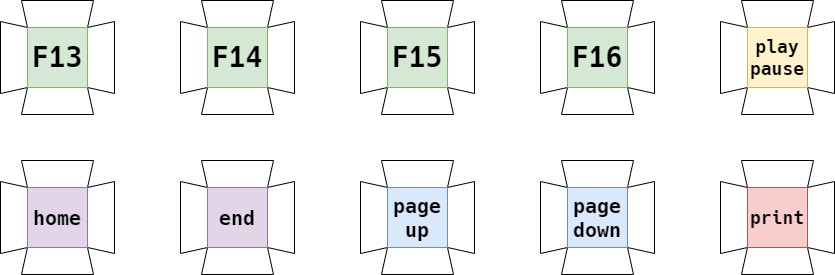
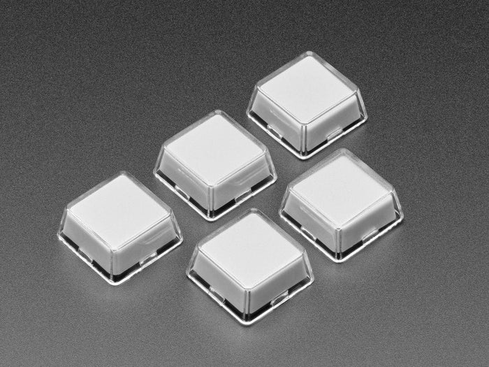
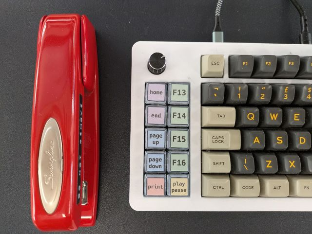

# Relegendable Keycaps Template

[draw.io](https://app.diagrams.net/) template for Relegendable Plastic Keycaps for MX Compatibile Switches

## Relegendable Keycaps

These keycaps are available from a variety of different vendors such as [Adafruit](https://www.adafruit.com/) or [The Pi Hut](https://thepihut.com/). I swear there was a decent template for making your legends but I couldn't find it. So I made my own. 

You can open the [relegendable-keycaps-template.drawio](./relegendable-keycaps-template.drawio) file with the on-line [draw.io](https://app.diagrams.net/) editor tool to change the colours and legends.

## In action

* The keyboard is a [keebio](https://keeb.io) [sinc](https://keeb.io/collections/sinc) rev 2.
* Why, yes! That is a red [Swingline](https://en.wikipedia.org/wiki/Swingline) stapler.

